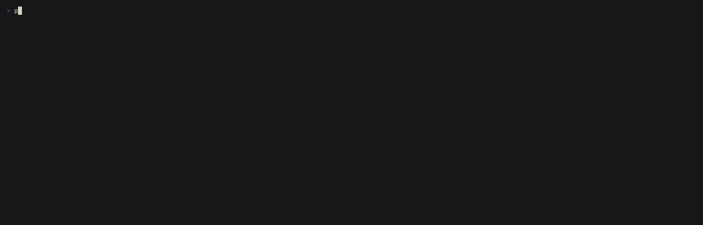
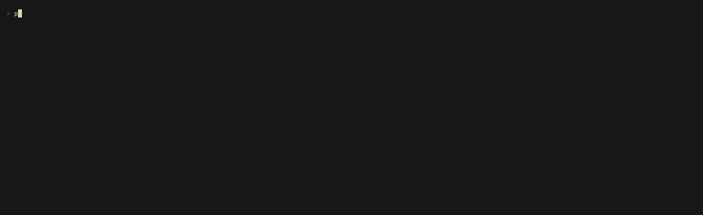

# legbar

One screen for the whole fleet: **live agent sessions beside GitHub CI**, drawn
from a single discovery layer so the two panes can never disagree.

`roost` answers *what are the models doing*. `leghorn` answers *what are the
repos doing*. Both are true at once and neither view contains the other — so
watching a fleet has meant watching two windows and joining them by eye.
legbar draws both lanes on one canvas.

```
legbar  5 sessions | 1 cursor | 1 need input | 15 ci red | 125k held | 18:37:00

SESSIONS                                                    CI / PRS
--------                                                    --------
cc heron-ops-3c FB5  ###-------  32% needsinput  dev        X  roost          ci
cc swamp-ops-ad OP5  ###-------  25% working     dev        X  roost          #56 ci: skip winget~
cc heron-ops-16 FB5  #---------  10% working     dev        X  copilot-money~ Tests
cc claude-10    OP5  #---------   8% idle        Claude     >  leghorn        release
cu c5468eb1     -                  - idle        dev        .  leghorn        #61 checks pending
```



The short ambient loop below is the same program, idling — which is how it
spends almost all of its time:



Both are real legbar, unmodified, reading a staged fleet — see
[demo/](demo/) for how it is built and how to re-record. The second contested
row is the one worth looking at: a Claude session and a **Cursor agent** in the
same working copy. Cursor writes no session marker and no claim, so a dashboard
reading only Claude's session directory cannot see that collision at all.

## What each lane shows

**SESSIONS** — every live agent on the machine. Claude Code sessions are joined
by pid against `~/.claude/sessions/<pid>.json`, with model, context burn, and
status read from the session's own JSONL transcript. **Cursor agents appear
too**, marked `cu` — Cursor writes no session marker and no claim, so a fleet
view that only reads Claude's session directory is blind to every Cursor agent
running beside it.

**CI / PRS** — GitHub Actions runs and open pull requests across every clone,
with failures pinned so a red build cannot scroll away.

## Install

```
pipx install legbar
```

Python 3.9+, standard library only. Works on macOS, Linux and Windows.

## Usage

```
legbar              # the full-screen view
legbar --once       # render one frame and exit (pipes, CI, screenshots)
legbar --json       # the joined state, for piping somewhere else
legbar --no-git     # skip git probing if it is ever slow
legbar --no-ci      # skip the gh sweep (offline, or when it is slow)
```

In the full-screen view: `q` quit, `g` toggle git probing, `r` refresh now.

## Configuration

Every override is `LEGBAR_*`. The older `roost` / `leghorn` / `ccwork` variable
names are still honoured, so an existing install keeps whatever it had
configured; the new name wins when both are set.

| Variable | Default | What it points at |
|---|---|---|
| `LEGBAR_REPOS_ROOT` | `~/GitHub` | where the clones live |
| `LEGBAR_SESSIONS_DIR` | `~/.claude/sessions` | live-session markers |
| `LEGBAR_PROJECTS_DIR` | `~/.claude/projects` | session transcripts |
| `LEGBAR_CURSOR_HOME` | `~/.cursor` | Cursor's agent transcripts |
| `LEGBAR_CURSOR_MAX_IDLE_SECS` | `86400` | how far back a Cursor agent counts as live |
| `LEGBAR_BACKENDS` | `claude,cursor` | which discovery lanes run at all |

## Two honest caveats

**Cursor liveness is inferred, not probed.** A Claude row means *this process
exists* (`os.kill(pid, 0)`). A Cursor row means *this transcript moved
recently* — Cursor writes no pid to join against. That is a weaker signal and
it is labelled as one; `pid` is `None` for Cursor rows rather than invented.

**Cursor's project slugs are lossy.** The slug joins path parts with `-`, and
`-` is legal inside a directory name, so `c-Users-me-dev-heron-ops` reads
equally as `dev/heron/ops` and `dev/heron-ops`. legbar resolves each segment
longest-first against what actually exists on disk. A slug that resolves
nowhere — another machine's checkout, a deleted clone — falls back to the
naive split rather than raising.

## It is ASCII on purpose

Block-drawing characters mojibake in the Windows console, so the context bars,
the pane rules and the status glyphs are all plain ASCII. Same constraint
`roost`'s sparklines and `leghorn`'s tables are built around.

```
       ,__
     _(o  \__
    /        \
   |  ======  |
   |  ======  |
    \  ====  /
     \______/
      ||  ||
      ^^  ^^
```

## Read-only

legbar reads transcripts and registries, and runs `git` and `gh` in read-only
modes. It never writes to a repo.

## The family

- **[roost](https://github.com/gmhoward9289-ops/roost)** — `top` for Claude
  Code: per-session context burn, models, and the subagents a session spawned.
- **[leghorn](https://github.com/gmhoward9289-ops/leghorn)** — the repo lane on
  its own: sessions joined to worktrees and real git state, CI, and a commit
  feed.
- **legbar** — both lanes on one screen, over one discovery layer.

`henhouse.py` is that discovery layer: sessions, transcripts, git, GitHub, and
Cursor. It is a working CLI in its own right (`python henhouse.py`).

## License

MIT
